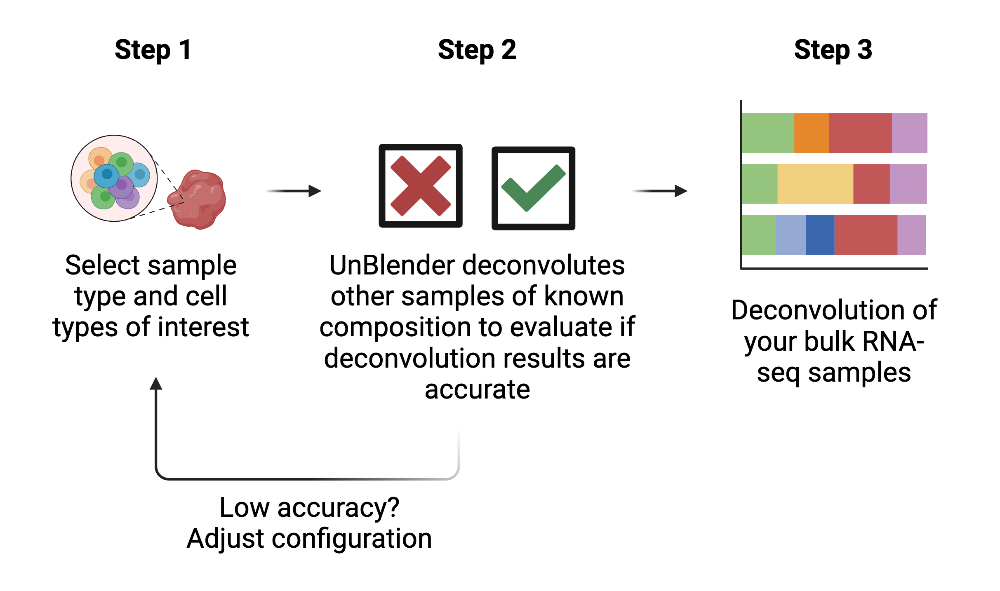

# UnBlender workflow

<b>UnBlender is in beta version and under active development. Please contact us at unblender.info at gmail dot com if any persistent issues occur.</b>
 If you prefer to deconvolute your bulk RNA-seq dataset on your own computer, UnBlender is available as a Pyhton pipeline to run locally on [github](   https://github.com/Nawijn-Group-Bioinformatics/UnBlender/).

## Introduction

UnBlender aims to improve cell type deconvolution analysis of respiratory samples. 

The UnBlender workflow:
- Allows you to select a customized set of cell types of interest to your analysis.
- Automatically validates your deconvolution approach to assess feasibility

Not all cell type combinations can be deconvoluted in any type of sample, which can lead to inaccurate output. 

UnBlender evaluates whether deconvolution is possible for your chosen cell types and sample type, so that you obtain reliable results.

## The UnBlender workflow:

{width=100%}

